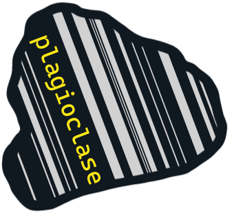

# plagioclase
_plagioclase_ offers a neat little command line tool to get quick information about minerals! Mineralogical data is scraped from a .pdf published by the International Mineralogical Association (CC BY-SA 3.0).

# Pending Features
- plagioclase name-like ___
    - Search mineral database and extract information for the given mineral, e.g.
    - \> plagioclase name-like Corundum 
    - will return something like
    > Name: Corundum
    > Formula: Al2O3
    > Mineral Group: Hematite group
    > etc.

- plagioclase formula-like ___
    - will search database for all minerals that contain ___ in their chemical formula, e.g.
    - \> plagioclase formula-like O2
    - will return something like
    > Name: Quartz. Formula: SiO2.
    > Name: ... . Formula: ...
    > etc.

# References
- For minerological data:
    - International Mineralogical Association (2023), The New IMA List of Minerals - A Work in Progress - Updated: September 2023, viewed 2023-09-17: <http://cnmnc.units.it/>.
- _plagioclase_ icon was made using [Excalidraw](https://excalidraw.com/)!
