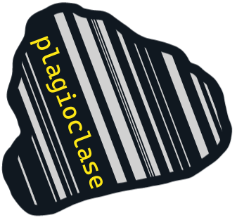

# _plagioclase_ iconography
## twinning plagioclase
The _plagioclase_ icon is based on an image of a thin section of albite, showing it's distinct "twinning" texture. The image is inspired by various images found in Google Images. 

## The colours
The three colours used are as follows:
- dark colour: #101820FF
- yellow: #FEE715FF
- grey: #C4C4C4C4

## Variants
- Variant 1: yellow fill

- Variant 2: with background

